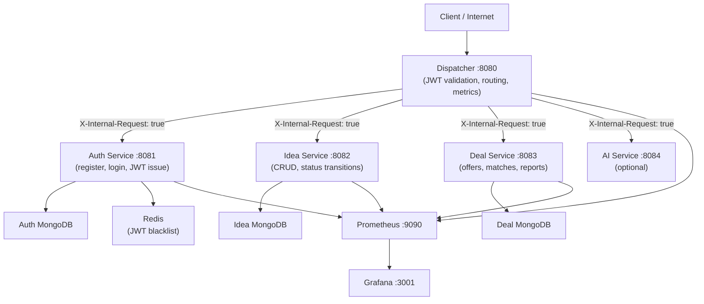
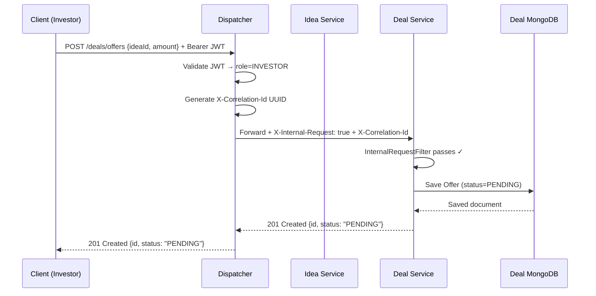
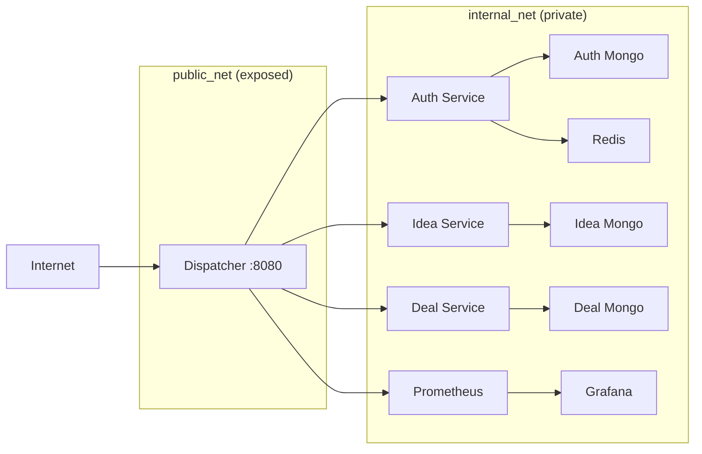

# InvestBridge — Java Microservices Investment Platform

> **A cloud-native investment matchmaking platform** connecting startup founders, investors, and admins through a secure, observable, fully-tested microservices architecture built with Java 21 + Spring Boot 3.

---

## Table of Contents

1. [Problem Statement](#1-problem-statement)
2. [Architecture Overview](#2-architecture-overview)
3. [Microservices & Database Isolation](#3-microservices--database-isolation)
4. [TDD Proof — All Services](#4-tdd-proof--all-services)
5. [REST Maturity Model (RMM Level 2)](#5-rest-maturity-model-rmm-level-2)
6. [Security & Network Isolation](#6-security--network-isolation)
7. [Observability](#7-observability)
8. [Running the Project](#8-running-the-project)
9. [Load Testing](#9-load-testing)
10. [Team & Contributions](#10-team--contributions)

---

## 1. Problem Statement

Early-stage startups struggle to connect with the right investors — cold emails get ignored, networking events are inaccessible, and there is no structured way to present a verified idea to a pool of serious investors.

**InvestBridge** solves this by providing a structured platform where:
- **Founders** submit and manage their startup ideas through a gated workflow (DRAFT → VERIFIED)
- **Investors** browse only admin-verified ideas and make formal investment offers
- **Admins** act as gatekeepers — verifying ideas and monitoring platform health
- All interactions are **audited**, **authenticated** via JWT, and **observable** through Prometheus + Grafana

---

## 2. Architecture Overview

All client traffic enters through a single public gateway — the **Dispatcher** on port `8080`. It validates JWTs, enforces role-based access, and proxies requests to internal services. No internal service is reachable from the internet.



### Sequence — Investor Makes an Offer



---

## 3. Microservices & Database Isolation

Each service owns its own MongoDB — **no service queries another service's database**. Cross-service data flows only through the Dispatcher.

| Service | Port | Database | Key Responsibility |
|---|---|---|---|
| **Dispatcher** | `8080` (public) | dispatcher-mongo | JWT validation, routing, retry policy, metrics |
| **Auth Service** | `8081` (internal) | auth-mongo | Register, login, logout, BCrypt, JWT issuance |
| **Idea Service** | `8082` (internal) | idea-mongo | Idea CRUD, DRAFT→VERIFIED workflow, role filtering |
| **Deal Service** | `8083` (internal) | deal-mongo | Investor profiles, offers, match creation, abuse reports |
| **AI Service** | `8084` (internal) | — | Idea analysis, investor matching (optional) |

### Network Isolation



> **Enforcement:** Every internal service runs an `InternalRequestFilter`. Any request missing the `X-Internal-Request: true` header is immediately rejected with `403 Forbidden` — even with a valid JWT.

---

## 4. TDD Proof — All Services

The entire platform was built following strict **Red → Green (→ Refactor)** TDD cycles. Failing tests were always committed before any implementation.

### Commit Timeline

```
e308d04  test: add dispatcher routing, authz and error handling tests (RED - 5 failing)   [Hamza AlHalabi]
320aaf5  GREEN test passed successfully 0 failure!                                          [Hamza AlHalabi]
e62bad2  refactor: extract interfaces, fix ProxyController path, add retry policy           [Hamza AlHalabi]
25014b0  test: add auth-service register, login, logout and /auth/me tests (RED - 11 failing) [Hamza AlHalabi]
1dbb480  feat: auth-service GREEN - all passing                                             [Hamza AlHalabi]
37614e5  test: add idea-service create, read, workflow tests (RED - 14 failing)             [EMAD-BME]
9e4713c  feat: idea-service GREEN - 18/18 passing                                          [EMAD-BME]
867722f  test(deal-service): RED phase — domain, stubs, and failing tests                  [EMAD-BME]
3b170e7  feat(deal-service): GREEN phase — full implementation passing all tests            [EMAD-BME]
```

### Test Results — All Services

| Service | Test Class | Tests | Result |
|---|---|---|---|
| **Dispatcher** | `DispatcherRoutingTest` | 3 | GREEN |
| **Dispatcher** | `DispatcherAuthzTest` | 7 | GREEN |
| **Dispatcher** | `DispatcherErrorTest` | 4 | GREEN |
| **Auth Service** | `AuthRegisterTest` | 5 | GREEN |
| **Auth Service** | `AuthLoginTest` | 4 | GREEN |
| **Auth Service** | `AuthMeTest` | 5 | GREEN |
| **Idea Service** | `IdeaCreateTest` | 4 | GREEN |
| **Idea Service** | `IdeaReadTest` | 6 | GREEN |
| **Idea Service** | `IdeaWorkflowTest` | 8 | GREEN |
| **Deal Service** | `DealProfileTest` | 5 | GREEN |
| **Deal Service** | `DealOfferTest` | 8 | GREEN |
| **Deal Service** | `DealMatchReportTest` | 7 | GREEN |
| | **Total** | **66** | **0 failures** |

```
[INFO] Tests run: 14, Failures: 0, Errors: 0, Skipped: 0  ← dispatcher
[INFO] Tests run: 14, Failures: 0, Errors: 0, Skipped: 0  ← auth-service
[INFO] Tests run: 18, Failures: 0, Errors: 0, Skipped: 0  ← idea-service
[INFO] Tests run: 20, Failures: 0, Errors: 0, Skipped: 0  ← deal-service
[INFO] BUILD SUCCESS
```

### TDD Pattern Used

Every service followed this exact cycle:

```
1. Write failing test  →  mvn test  →  RED  ← committed here
2. Write minimal implementation
3. mvn test  →  GREEN  ← committed here
4. Refactor (dispatcher only) → mvn test → still GREEN ← committed
```

**Test infrastructure** (same pattern across all services):
- `@SpringBootTest + @AutoConfigureMockMvc + @ActiveProfiles("test")`
- `application-test.yml` excludes MongoDB/Redis auto-config
- `@MockBean` for all repositories → no real database needed
- `MockMvc` for HTTP assertions

---

## 5. REST Maturity Model (RMM Level 2)

All endpoints use **resource nouns**, correct **HTTP verbs**, and meaningful **status codes** — satisfying Richardson Maturity Model Level 2.

### Auth Service (`/auth/**`)

| Endpoint | Method | Success | Error Codes | Notes |
|---|---|---|---|---|
| `/auth/register` | `POST` | `201 Created` | `409 Conflict` | Duplicate email |
| `/auth/login` | `POST` | `200 OK` | `401 Unauthorized` | Wrong credentials |
| `/auth/logout` | `POST` | `200 OK` | `401` | Blacklists token in Redis |
| `/auth/me` | `GET` | `200 OK` | `401`, `403` | Reads from forwarded JWT headers |

### Idea Service (`/ideas/**`)

| Endpoint | Method | Success | Error Codes | Notes |
|---|---|---|---|---|
| `/ideas` | `POST` | `201 Created` | `400`, `403` | FOUNDER only |
| `/ideas` | `GET` | `200 OK` | `401` | INVESTOR→verified only, FOUNDER→own, ADMIN→all |
| `/ideas/{id}` | `GET` | `200 OK` | `404` | Any authenticated user |
| `/ideas/{id}` | `PUT` | `200 OK` | `403`, `404` | Owner + status=DRAFT |
| `/ideas/{id}` | `DELETE` | `204 No Content` | `403`, `404` | Owner + status=DRAFT |
| `/ideas/{id}/verify` | `PATCH` | `200 OK` | `403` | ADMIN only → sets VERIFIED |
| `/ideas/{id}/reject` | `PATCH` | `200 OK` | `403` | ADMIN only → sets REJECTED |

### Deal Service (`/deals/**`)

| Endpoint | Method | Success | Error Codes | Notes |
|---|---|---|---|---|
| `/deals/profiles` | `POST` | `201 Created` | `409 Conflict` | INVESTOR only, one per user |
| `/deals/profiles/me` | `GET` | `200 OK` | `404` | Own profile |
| `/deals/offers` | `POST` | `201 Created` | `400` | INVESTOR only |
| `/deals/offers/{id}` | `GET` | `200 OK` | `404` | |
| `/deals/offers/{id}/accept` | `PATCH` | `200 OK` | `403`, `404` | FOUNDER only; creates Match |
| `/deals/offers/{id}/reject` | `PATCH` | `200 OK` | `403`, `404` | FOUNDER only |
| `/deals/matches` | `GET` | `200 OK` | `401` | Role-aware: INVESTOR or FOUNDER |
| `/deals/reports` | `POST` | `201 Created` | `400` | Any authenticated user |

---

## 6. Security & Network Isolation

### JWT Flow

```
Client  →  Dispatcher  →  validates JWT (HS256, jjwt 0.12.3)
                       →  extracts userId + role
                       →  injects X-User-Id, X-User-Role headers
                       →  forwards to internal service
```

- Tokens are **stateless** (HS256, 1h expiry)
- Logout **blacklists** the token in Redis — subsequent requests with that token are rejected
- Passwords are hashed with **BCrypt** (strength 10)

### Role-Based Access (Dispatcher Level)

| Path | Roles Allowed |
|---|---|
| `/auth/**` | Public (no JWT required) |
| `GET /ideas`, `GET /deals` | `INVESTOR`, `ADMIN` |
| `/ideas/**`, `/deals/**`, `/ai/**` | Any authenticated user (fine-grained checks in service) |

### Retry Policy (Dispatcher)

When a downstream service is unreachable, the Dispatcher retries **3 times** with **linear backoff**:

```
Attempt 1 → wait 200ms → Attempt 2 → wait 400ms → Attempt 3 → wait 600ms → 503
```

### Correlation ID Propagation

Every request gets a `X-Correlation-Id` UUID (generated by the Dispatcher if absent). It flows through all services via HTTP headers and is added to MDC — every log line from every service carries the same ID, enabling end-to-end tracing.

---

## 7. Observability

### Metrics (Prometheus + Grafana)

All services expose `/actuator/prometheus`. Prometheus scrapes every 15s. Grafana auto-provisions the **InvestBridge Platform** dashboard on startup.

| Metric | Source | Description |
|---|---|---|
| `dispatcher_requests_total` | Dispatcher (custom) | Request count by route, method, status |
| `dispatcher_request_duration_ms` | Dispatcher (custom) | Duration histogram by route |
| `http_server_requests_seconds` | Spring Actuator | Per-endpoint latency histogram |
| `jvm_memory_used_bytes` | Spring Actuator | Heap/non-heap per service |
| `process_cpu_usage` | Spring Actuator | CPU per service |
| `jvm_threads_live_threads` | Spring Actuator | Active threads per service |

**Access Grafana:** `http://localhost:3001` → `admin` / `admin`  
The **InvestBridge Platform** dashboard loads automatically — no manual import needed.

### Structured JSON Logging

All services emit JSON logs via `logstash-logback-encoder`. Every line includes:

```json
{
  "timestamp": "2026-04-04T12:00:00.000Z",
  "level": "INFO",
  "service": "deal-service",
  "correlation_id": "f47ac10b-58cc-4372-a567-0e02b2c3d479",
  "logger": "com.platform.deal.controller.DealController",
  "thread": "http-nio-8083-exec-3",
  "message": "Offer accepted — offerId=off1 founderId=founder1"
}
```

---

## 8. Running the Project

### Prerequisites

| Tool | Version |
|---|---|
| Docker Desktop | v24+ |
| Java | 21 |
| Maven | 3.9+ |
| k6 *(load tests only)* | latest |

### Start the Full Stack

```bash
# 1. Clone
git clone https://github.com/TheGhost966/InvestBridge.git
cd InvestBridge

# 2. Set JWT secret (required)
echo "JWT_SECRET=this-is-a-32-character-secret-key" > .env

# 3. Build + start everything
docker-compose up --build -d

# 4. Verify all containers are healthy
docker-compose ps
```

### Verify Services

```bash
# Dispatcher health
curl http://localhost:8080/actuator/health

# Register a founder
curl -X POST http://localhost:8080/auth/register \
  -H "Content-Type: application/json" \
  -d '{"email":"founder@test.com","password":"Test1234!","role":"FOUNDER"}'

# Login
curl -X POST http://localhost:8080/auth/login \
  -H "Content-Type: application/json" \
  -d '{"email":"founder@test.com","password":"Test1234!"}'

# Open Grafana dashboard
# http://localhost:3001  (admin / admin)
```

### Ports

| Service | URL |
|---|---|
| Dispatcher (API entry point) | `http://localhost:8080` |
| Grafana | `http://localhost:3001` |
| Prometheus | `http://localhost:9090` *(internal — not exposed by default)* |

---

## 9. Load Testing

Load tests target the **Dispatcher** (`http://localhost:8080`) — the only public entry point.

### Test Scripts

| Script | VUs | Duration | What It Tests |
|---|---|---|---|
| `k6/smoke_test.js` | 1 | ~10s | All endpoints reachable, correct status codes |
| `k6/spike_test.js` | 0 → 50 → 0 | ~50s | Resilience under sudden traffic burst |
| `k6/sustained_test.js` | 0 → 20 → 0 | ~6 min | Full business flow under steady load |

### Running the Tests

```bash
# Install k6
winget install k6           # Windows
brew install k6             # macOS

# 1. Smoke test first (always)
k6 run k6/smoke_test.js

# 2. Spike test
k6 run k6/spike_test.js

# 3. Sustained load test (full lifecycle)
k6 run k6/sustained_test.js
```

### Performance Thresholds

| Metric | Spike Threshold | Sustained Threshold |
|---|---|---|
| `http_req_failed` | < 5% | < 1% |
| `http_req_duration p(95)` | < 2000ms | < 500ms |
| `http_req_duration p(99)` | — | < 1000ms |
| `checks` pass rate | > 95% | > 99% |

### Sustained Test — Business Flow Per VU

Each virtual user executes the complete 8-step investment lifecycle:

```
1. Register as FOUNDER  →  Login
2. Register as INVESTOR →  Login
3. FOUNDER creates Idea
4. INVESTOR lists verified Ideas
5. INVESTOR creates investor Profile
6. INVESTOR makes Offer on Idea
7. FOUNDER accepts Offer  →  Match created automatically
8. INVESTOR checks Matches
```

---

## 10. Team & Contributions

| Member | GitHub | Key Contributions |
|---|---|---|
| **Hamza AlHalabi** | [@TheGhost966](https://github.com/TheGhost966) | Project setup, Dispatcher (TDD RED/GREEN/Refactor), Auth Service (TDD), Docker + docker-compose, Prometheus config, Dockerfiles |
| **Emad** | [@EMAD-BME](https://github.com/EMAD-BME) | Idea Service (TDD RED/GREEN), Deal Service (TDD RED/GREEN), Observability (correlation IDs, JSON logging), Grafana dashboards, Load Testing (k6) |

```bash
# Verify commit distribution
git shortlog -sn --all
# 17  Hamza AlHalabi
#  7  EMAD-BME
```

---

*Built for the Java Microservices (BSM) Lab — Spring 2026.*  
*Java 21 · Spring Boot 3.3.1 · MongoDB · Redis · Prometheus · Grafana · k6*
