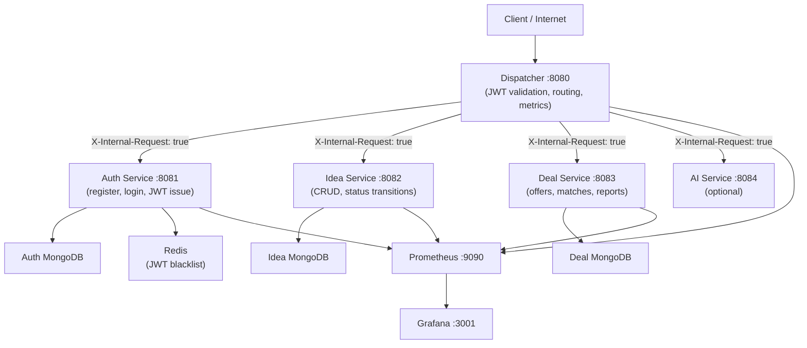
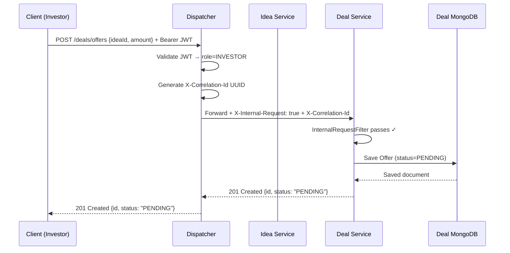
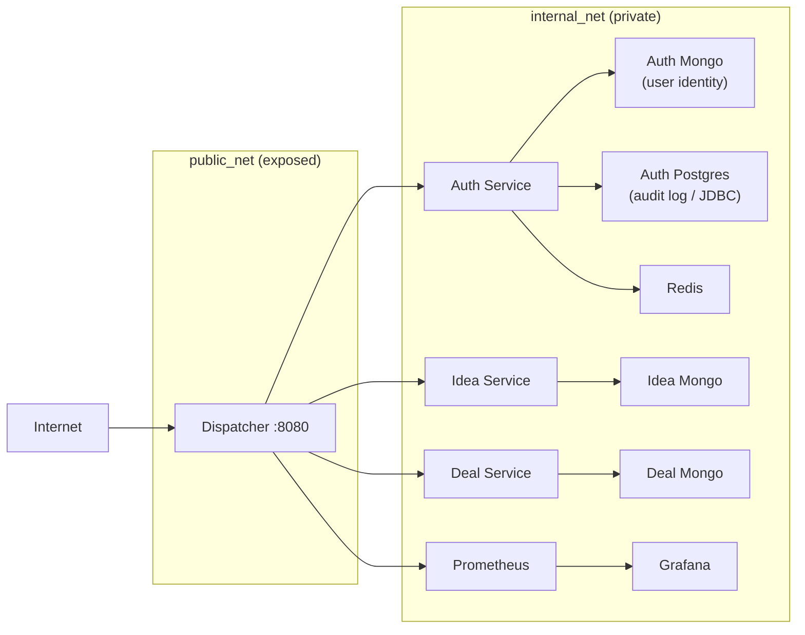
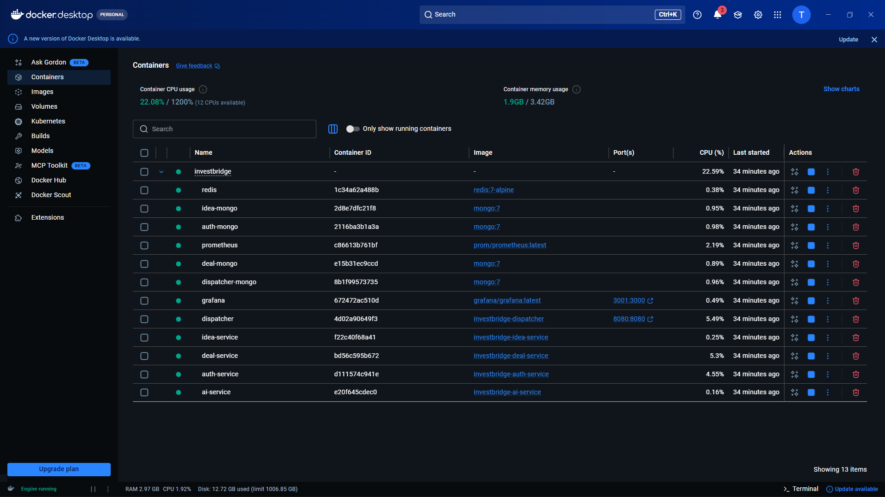
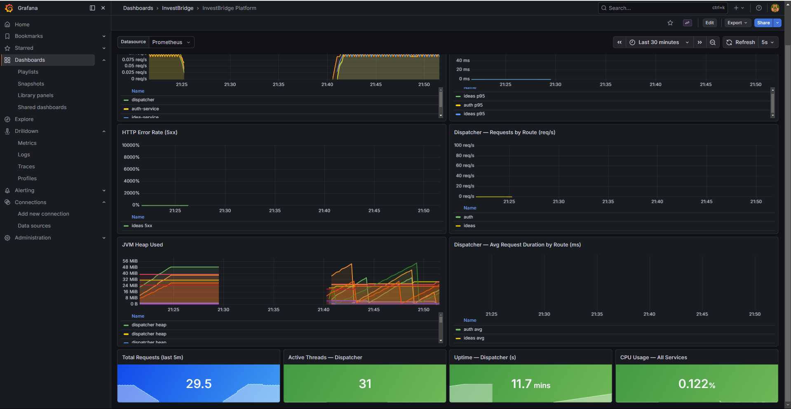
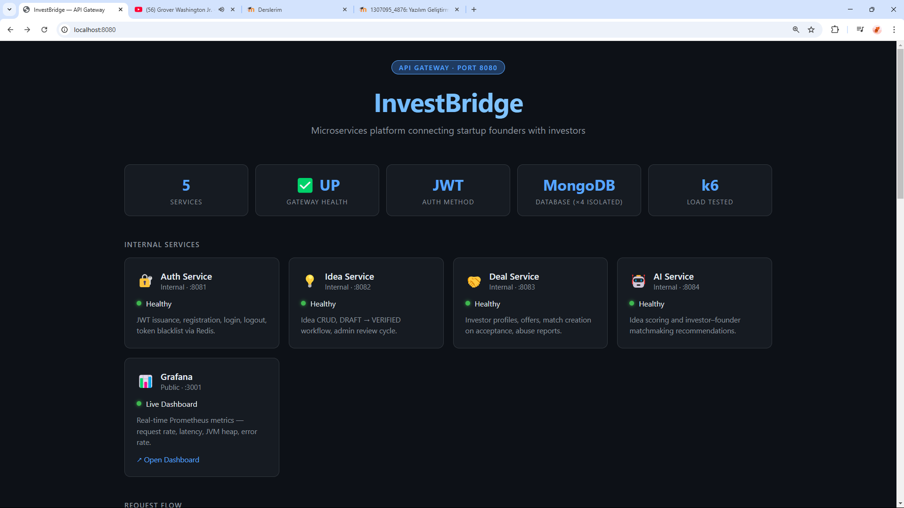
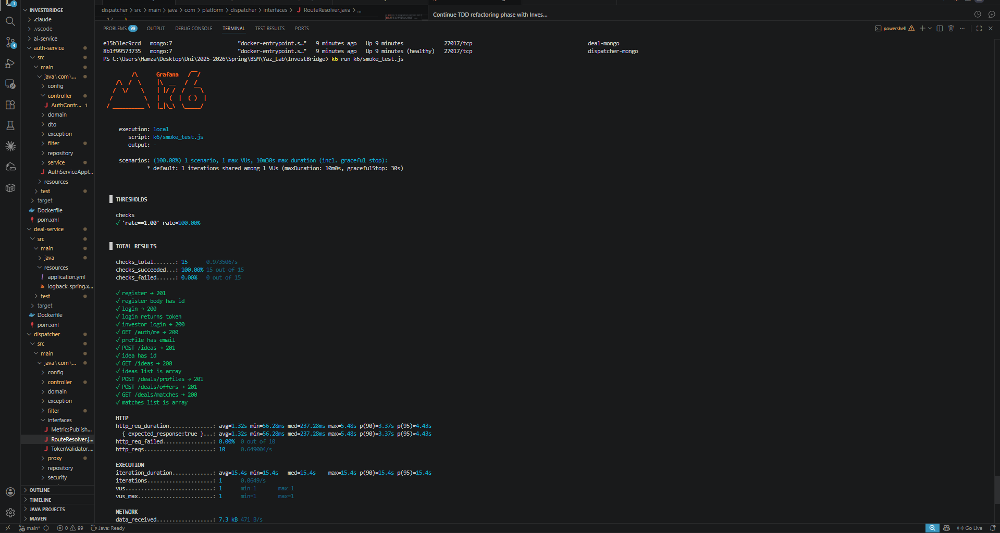
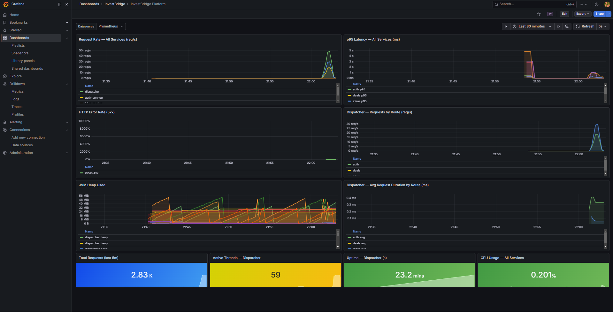

# InvestBridge — Java Microservices Investment Platform

> **A cloud-native investment matchmaking platform** connecting startup founders, investors, and admins through a secure, observable, fully-tested microservices architecture built with Java 21 + Spring Boot 3.

---

## Table of Contents

1. [Problem Statement](#1-problem-statement)
2. [Architecture Overview](#2-architecture-overview)
3. [Microservices & Database Isolation](#3-microservices--database-isolation)
4. [TDD Proof — All Services](#4-tdd-proof--all-services)
5. [REST Maturity Model (RMM Level 2)](#5-rest-maturity-model-rmm-level-2)
6. [Security & Network Isolation](#6-security--network-isolation)
7. [Observability](#7-observability)
8. [Running the Project](#8-running-the-project)
9. [Demo Walkthrough](#9-demo-walkthrough)
10. [Load Testing](#10-load-testing)
11. [Team & Contributions](#11-team--contributions)

---

## 1. Problem Statement

Early-stage startups struggle to connect with the right investors — cold emails get ignored, networking events are inaccessible, and there is no structured way to present a verified idea to a pool of serious investors.

**InvestBridge** solves this by providing a structured platform where:
- **Founders** submit and manage their startup ideas through a gated workflow (DRAFT → VERIFIED)
- **Investors** browse only admin-verified ideas and make formal investment offers
- **Admins** act as gatekeepers — verifying ideas and monitoring platform health
- All interactions are **audited**, **authenticated** via JWT, and **observable** through Prometheus + Grafana

---

## 2. Architecture Overview

All client traffic enters through a single public gateway — the **Dispatcher** on port `8080`. It validates JWTs, enforces role-based access, and proxies requests to internal services. No internal service is reachable from the internet.



### Sequence — Investor Makes an Offer



---

## 3. Microservices & Database Isolation

Each service owns its own database — **no service queries another service's database**. Cross-service data flows only through the Dispatcher.

| Service | Port | Database(s) | Key Responsibility |
|---|---|---|---|
| **Dispatcher** | `8080` (public) | dispatcher-mongo | JWT validation, routing, retry policy, metrics |
| **Auth Service** | `8081` (internal) | auth-mongo **+** auth-postgres | Register, login, logout, BCrypt, JWT issuance; audit logs via JDBC |
| **Idea Service** | `8082` (internal) | idea-mongo | Idea CRUD, DRAFT→VERIFIED workflow, role filtering |
| **Deal Service** | `8083` (internal) | deal-mongo | Investor profiles, offers, match creation, abuse reports |
| **AI Service** | `8084` (internal) | — | Idea analysis, investor matching (optional) |

### 3.1 JDBC ↔ NoSQL Isolation (Auth Service)

The auth service deliberately splits its storage along **responsibility boundaries**, not technology preference:

| Kind of data | Store | Layer | Why |
|---|---|---|---|
| User identity (email, BCrypt hash, role) | **MongoDB** | `UserRepository` (Spring Data) | Flexible schema; rarely joined |
| Auth audit log (login / logout / register) | **PostgreSQL** | `JdbcAuditLogWriter` (raw JDBC) | Append-only; queried by time range; demands ACID + indexes |

The two layers **never join or cross-reference** at the query level. The audit writer is abstracted behind the `AuditLogWriter` interface and injected via `ObjectProvider<T>`, so the service still starts if the JDBC DataSource is absent (unit tests) — failure to write an audit log logs a warning rather than failing the login.

```
com.platform.auth.audit
├── AuditLogWriter.java            // interface — Dependency Inversion
├── AuditEvent.java                // POJO — Single Responsibility
├── AuditDataSourceConfig.java     // @ConditionalOnProperty — only built when audit.jdbc.url is set
├── JdbcAuditLogWriter.java        // raw DataSource → PreparedStatement → ResultSet
└── AuditPersistenceException.java // wraps SQLException for global handler
```

The schema (`auth-service/src/main/resources/db/init.sql`) is mounted into the Postgres container at startup AND is re-used by the Testcontainers integration test, so schema drift between dev/test is impossible.

### 3.2 Shared Generic Types (`common/` module)

A separate Maven module provides `Generic<T>` building blocks reused across services — satisfying the "parametric typing" rubric criterion with real production usage (not just demo code):

| Class | Signature | Used by |
|---|---|---|
| `ApiResponse<T>` | `ApiResponse<T> { T data; List<String> errors; Instant timestamp; }` | `idea-service` `/ideas/paged` response envelope |
| `PagedResult<T>` | `PagedResult<T> { List<T> items; int page, size, totalPages; long totalElements; }` | `idea-service` `IdeaService.listPaged()` |
| `GenericCache<K,V>` | `interface GenericCache<K,V> { Optional<V> get(K); void put(K,V); ... }` | Available to all services |
| `InMemoryCache<K,V>` | `ConcurrentHashMap`-backed impl of `GenericCache` | Reference implementation |
| `CrudRepository<T,ID>` | `interface CrudRepository<T,ID>` | Shared repository abstraction |

All classes are unit-tested in `common/src/test/java` (9/9 green) and each consumer service pulls `common` as a Maven dependency.

### Network Isolation



> **Enforcement:** Every internal service runs an `InternalRequestFilter`. Any request missing the `X-Internal-Request: true` header is immediately rejected with `403 Forbidden` — even with a valid JWT.

---

## 4. TDD Proof — All Services

The entire platform was built following strict **Red → Green (→ Refactor)** TDD cycles. Failing tests were always committed before any implementation.

### Commit Timeline

```
e308d04  test: add dispatcher routing, authz and error handling tests (RED - 5 failing)   [Hamza AlHalabi]
320aaf5  GREEN test passed successfully 0 failure!                                          [Hamza AlHalabi]
e62bad2  refactor: extract interfaces, fix ProxyController path, add retry policy           [Hamza AlHalabi]
25014b0  test: add auth-service register, login, logout and /auth/me tests (RED - 11 failing) [Hamza AlHalabi]
1dbb480  feat: auth-service GREEN - all passing                                             [Hamza AlHalabi]
37614e5  test: add idea-service create, read, workflow tests (RED - 14 failing)             [EMAD-BME]
9e4713c  feat: idea-service GREEN - 18/18 passing                                          [EMAD-BME]
867722f  test(deal-service): RED phase — domain, stubs, and failing tests                  [EMAD-BME]
3b170e7  feat(deal-service): GREEN phase — full implementation passing all tests            [EMAD-BME]
```

### Test Results — All Services

| Service | Test Class | Tests | Result |
|---|---|---|---|
| **Dispatcher** | `DispatcherRoutingTest` | 3 | GREEN |
| **Dispatcher** | `DispatcherAuthzTest` | 7 | GREEN |
| **Dispatcher** | `DispatcherErrorTest` | 4 | GREEN |
| **Auth Service** | `AuthRegisterTest` | 5 | GREEN |
| **Auth Service** | `AuthLoginTest` | 4 | GREEN |
| **Auth Service** | `AuthMeTest` | 5 | GREEN |
| **Idea Service** | `IdeaCreateTest` | 4 | GREEN |
| **Idea Service** | `IdeaReadTest` | 6 | GREEN |
| **Idea Service** | `IdeaWorkflowTest` | 8 | GREEN |
| **Deal Service** | `DealProfileTest` | 5 | GREEN |
| **Deal Service** | `DealOfferTest` | 8 | GREEN |
| **Deal Service** | `DealMatchReportTest` | 7 | GREEN |
| | **Total** | **66** | **0 failures** |

```
[INFO] Tests run: 14, Failures: 0, Errors: 0, Skipped: 0  ← dispatcher
[INFO] Tests run: 14, Failures: 0, Errors: 0, Skipped: 0  ← auth-service
[INFO] Tests run: 18, Failures: 0, Errors: 0, Skipped: 0  ← idea-service
[INFO] Tests run: 20, Failures: 0, Errors: 0, Skipped: 0  ← deal-service
[INFO] BUILD SUCCESS
```

### TDD Pattern Used

Every service followed this exact cycle:

```
1. Write failing test  →  mvn test  →  RED  ← committed here
2. Write minimal implementation
3. mvn test  →  GREEN  ← committed here
4. Refactor (dispatcher only) → mvn test → still GREEN ← committed
```

**Test infrastructure** (same pattern across all services):
- `@SpringBootTest + @AutoConfigureMockMvc + @ActiveProfiles("test")`
- `application-test.yml` excludes MongoDB/Redis auto-config
- `@MockBean` for all repositories → no real database needed
- `MockMvc` for HTTP assertions

---

## 5. REST Maturity Model (RMM Level 2)

All endpoints use **resource nouns**, correct **HTTP verbs**, and meaningful **status codes** — satisfying Richardson Maturity Model Level 2.

### Auth Service (`/auth/**`)

| Endpoint | Method | Success | Error Codes | Notes |
|---|---|---|---|---|
| `/auth/register` | `POST` | `201 Created` | `409 Conflict` | Duplicate email |
| `/auth/login` | `POST` | `200 OK` | `401 Unauthorized` | Wrong credentials |
| `/auth/logout` | `POST` | `200 OK` | `401` | Blacklists token in Redis |
| `/auth/me` | `GET` | `200 OK` | `401`, `403` | Reads from forwarded JWT headers |

### Idea Service (`/ideas/**`)

| Endpoint | Method | Success | Error Codes | Notes |
|---|---|---|---|---|
| `/ideas` | `POST` | `201 Created` | `400`, `403` | FOUNDER only |
| `/ideas` | `GET` | `200 OK` | `401` | INVESTOR→verified only, FOUNDER→own, ADMIN→all |
| `/ideas/{id}` | `GET` | `200 OK` | `404` | Any authenticated user |
| `/ideas/{id}` | `PUT` | `200 OK` | `403`, `404` | Owner + status=DRAFT or REJECTED (resets to DRAFT) |
| `/ideas/{id}` | `DELETE` | `204 No Content` | `403`, `404` | Owner + status=DRAFT |
| `/ideas/{id}/verify` | `PATCH` | `200 OK` | `403` | ADMIN only → sets VERIFIED |
| `/ideas/{id}/reject` | `PATCH` | `200 OK` | `403` | ADMIN only → sets REJECTED |

### Deal Service (`/deals/**`)

| Endpoint | Method | Success | Error Codes | Notes |
|---|---|---|---|---|
| `/deals/profiles` | `POST` | `201 Created` | `409 Conflict` | INVESTOR only, one per user |
| `/deals/profiles/me` | `GET` | `200 OK` | `404` | Own profile |
| `/deals/offers` | `POST` | `201 Created` | `400` | INVESTOR only |
| `/deals/offers/{id}` | `GET` | `200 OK` | `404` | |
| `/deals/offers/{id}/accept` | `PATCH` | `200 OK` | `403`, `404` | FOUNDER only; creates Match |
| `/deals/offers/{id}/reject` | `PATCH` | `200 OK` | `403`, `404` | FOUNDER only |
| `/deals/matches` | `GET` | `200 OK` | `401` | Role-aware: INVESTOR or FOUNDER |
| `/deals/reports` | `POST` | `201 Created` | `400` | Any authenticated user |

---

## 6. Security & Network Isolation

### JWT Flow

```
Client  →  Dispatcher  →  validates JWT (HS256, jjwt 0.12.3)
                       →  extracts userId + role
                       →  injects X-User-Id, X-User-Role headers
                       →  forwards to internal service
```

- Tokens are **stateless** (HS256, 1h expiry)
- Logout **blacklists** the token in Redis — subsequent requests with that token are rejected
- Passwords are hashed with **BCrypt** (strength 10)

### Role-Based Access (Dispatcher Level)

| Path | Roles Allowed |
|---|---|
| `/auth/**` | Public (no JWT required) |
| `GET /ideas`, `GET /deals` | `INVESTOR`, `ADMIN` |
| `/ideas/**`, `/deals/**`, `/ai/**` | Any authenticated user (fine-grained checks in service) |

### Retry Policy (Dispatcher)

When a downstream service is unreachable, the Dispatcher retries **3 times** with **linear backoff**:

```
Attempt 1 → wait 200ms → Attempt 2 → wait 400ms → Attempt 3 → wait 600ms → 503
```

### Correlation ID Propagation

Every request gets a `X-Correlation-Id` UUID (generated by the Dispatcher if absent). It flows through all services via HTTP headers and is added to MDC — every log line from every service carries the same ID, enabling end-to-end tracing.

---

## 7. Observability

### Metrics (Prometheus + Grafana)

All services expose `/actuator/prometheus`. Prometheus scrapes every 15s. Grafana auto-provisions the **InvestBridge Platform** dashboard on startup.

| Metric | Source | Description |
|---|---|---|
| `dispatcher_requests_total` | Dispatcher (custom) | Request count by route, method, status |
| `dispatcher_request_duration_ms` | Dispatcher (custom) | Duration histogram by route |
| `http_server_requests_seconds` | Spring Actuator | Per-endpoint latency histogram |
| `jvm_memory_used_bytes` | Spring Actuator | Heap/non-heap per service |
| `process_cpu_usage` | Spring Actuator | CPU per service |
| `jvm_threads_live_threads` | Spring Actuator | Active threads per service |

**Access Grafana:** `http://localhost:3001` → `admin` / `admin`
The **InvestBridge Platform** dashboard loads automatically — no manual import needed.

**Docker Services** (all services `State: UP`):



**Grafana dashboard** — request rate and latency panels update in real time as load tests run:



### Structured JSON Logging

All services emit JSON logs via `logstash-logback-encoder`. Every line includes:

```json
{
  "timestamp": "2026-04-04T12:00:00.000Z",
  "level": "INFO",
  "service": "deal-service",
  "correlation_id": "f47ac10b-58cc-4372-a567-0e02b2c3d479",
  "logger": "com.platform.deal.controller.DealController",
  "thread": "http-nio-8083-exec-3",
  "message": "Offer accepted — offerId=off1 founderId=founder1"
}
```

---

## 8. Running the Project

### Prerequisites

| Tool | Version |
|---|---|
| Docker Desktop | v24+ |
| Java | 21 |
| Maven | 3.9+ |
| k6 *(load tests only)* | latest |

### Start the Full Stack

```bash
# 1. Clone
git clone https://github.com/TheGhost966/InvestBridge.git
cd InvestBridge

# 2. Set JWT secret (required)
echo "JWT_SECRET=this-is-a-32-character-secret-key" > .env

# 3. Build + start everything
docker-compose up --build -d

# 4. Verify all containers are healthy
docker-compose ps
```

**Landing page** — open `http://localhost:8080` in your browser after the stack is up:



### Verify Services

```bash
# Dispatcher health
curl http://localhost:8080/actuator/health

# Register a founder
curl -X POST http://localhost:8080/auth/register \
  -H "Content-Type: application/json" \
  -d '{"email":"founder@test.com","password":"Test1234!","role":"FOUNDER"}'

# Login
curl -X POST http://localhost:8080/auth/login \
  -H "Content-Type: application/json" \
  -d '{"email":"founder@test.com","password":"Test1234!"}'

# Open Grafana dashboard
# http://localhost:3001  (admin / admin)
```

### Ports

| Service | URL |
|---|---|
| Dispatcher (API entry point) | `http://localhost:8080` |
| Grafana | `http://localhost:3001` |
| Prometheus | `http://localhost:9090` *(internal — not exposed by default)* |

### Running Tests

```bash
# Unit tests only — no Docker required
mvn test

# Including the Testcontainers JDBC integration test (starts a real postgres:16 container)
mvn test -DrunDockerITs=true -pl auth-service
```

The `JdbcAuditLogWriterContainerTest` spins up a real PostgreSQL container via Testcontainers, runs `db/init.sql` against it, and exercises `JdbcAuditLogWriter` end-to-end (insert, generated keys, ordering, limit, exception wrapping). It is gated behind a flag because Testcontainers requires Docker Desktop to expose an engine socket the docker-java client can reach (on Windows: enable *Settings → General → Expose daemon on tcp://localhost:2375 without TLS*, then set `DOCKER_HOST=tcp://localhost:2375`).

---

## 9. Demo Walkthrough

This section shows every key system behaviour live. Run these commands after `docker-compose up --build -d`.

---

### 9.1 JWT Flow — Register → Login → Use Token

```bash
# Step 1 — Register a FOUNDER
curl -s -X POST http://localhost:8080/auth/register \
  -H "Content-Type: application/json" \
  -d '{"email":"founder@demo.com","password":"Demo1234!","role":"FOUNDER"}'
# → 201 Created  {"id":"...","email":"founder@demo.com","role":"FOUNDER"}

# Step 2 — Login and capture the token
TOKEN=$(curl -s -X POST http://localhost:8080/auth/login \
  -H "Content-Type: application/json" \
  -d '{"email":"founder@demo.com","password":"Demo1234!"}' \
  | grep -o '"token":"[^"]*"' | cut -d'"' -f4)

echo $TOKEN   # ← eyJhbGciOiJIUzI1NiJ9...

# Step 3 — Use the token to call a protected endpoint
curl -s http://localhost:8080/auth/me \
  -H "Authorization: Bearer $TOKEN"
# → 200 OK  {"userId":"...","email":"founder@demo.com","role":"FOUNDER"}
```

---

### 9.2 Role-Based Access — Same Endpoint, Different Data

The `GET /ideas` endpoint returns **different results** depending on the caller's role:

```bash
# Register an INVESTOR and an ADMIN
curl -s -X POST http://localhost:8080/auth/register \
  -H "Content-Type: application/json" \
  -d '{"email":"investor@demo.com","password":"Demo1234!","role":"INVESTOR"}'

curl -s -X POST http://localhost:8080/auth/register \
  -H "Content-Type: application/json" \
  -d '{"email":"admin@demo.com","password":"Demo1234!","role":"ADMIN"}'

# Capture their tokens
INVESTOR_TOKEN=$(curl -s -X POST http://localhost:8080/auth/login \
  -H "Content-Type: application/json" \
  -d '{"email":"investor@demo.com","password":"Demo1234!"}' \
  | grep -o '"token":"[^"]*"' | cut -d'"' -f4)

ADMIN_TOKEN=$(curl -s -X POST http://localhost:8080/auth/login \
  -H "Content-Type: application/json" \
  -d '{"email":"admin@demo.com","password":"Demo1234!"}' \
  | grep -o '"token":"[^"]*"' | cut -d'"' -f4)

# FOUNDER sees only their own ideas (any status)
curl -s http://localhost:8080/ideas -H "Authorization: Bearer $TOKEN"
# → [...ideas where ownerId == this founder...]

# INVESTOR sees only VERIFIED ideas
curl -s http://localhost:8080/ideas -H "Authorization: Bearer $INVESTOR_TOKEN"
# → [...ideas where status == "VERIFIED" only...]

# ADMIN sees everything
curl -s http://localhost:8080/ideas -H "Authorization: Bearer $ADMIN_TOKEN"
# → [...ALL ideas regardless of status...]
```

---

### 9.3 Error Forwarding — Real 401, 403, 404

```bash
# 401 — No token at all
curl -s -o /dev/null -w "%{http_code}" http://localhost:8080/ideas
# → 401

# 401 — Expired / invalid token
curl -s -o /dev/null -w "%{http_code}" http://localhost:8080/ideas \
  -H "Authorization: Bearer not.a.real.token"
# → 401

# 403 — INVESTOR trying to create an idea (FOUNDER-only endpoint)
curl -s -o /dev/null -w "%{http_code}" \
  -X POST http://localhost:8080/ideas \
  -H "Authorization: Bearer $INVESTOR_TOKEN" \
  -H "Content-Type: application/json" \
  -d '{"title":"Hack","description":"...","fundingGoal":1000}'
# → 403

# 404 — Idea ID that does not exist
curl -s -o /dev/null -w "%{http_code}" \
  http://localhost:8080/ideas/000000000000000000000000 \
  -H "Authorization: Bearer $TOKEN"
# → 404
```

---

### 9.4 Retry / Circuit Breaker — Kill a Service, Watch the 503

Open two terminals.

**Terminal 1 — kill the idea-service:**
```bash
docker stop idea-service
```

**Terminal 2 — hit GET /ideas and watch the Dispatcher retry log:**
```bash
curl -s -w "\nHTTP %{http_code}\n" http://localhost:8080/ideas \
  -H "Authorization: Bearer $INVESTOR_TOKEN"
# → HTTP 503

# Dispatcher logs (docker logs dispatcher --tail 20) will show:
# WARN  Attempt 1 failed for GET http://idea-service:8082/ideas — retrying in 200ms
# WARN  Attempt 2 failed for GET http://idea-service:8082/ideas — retrying in 400ms
# WARN  Attempt 3 failed for GET http://idea-service:8082/ideas — retrying in 600ms
# ERROR All 3 attempts exhausted — returning 503
docker logs dispatcher --tail 20
```

**Bring it back:**
```bash
docker start idea-service
```

---

### 9.5 REJECTED → Revise Flow (Full Lifecycle)

```bash
# 1. FOUNDER creates an idea (status = DRAFT)
IDEA_ID=$(curl -s -X POST http://localhost:8080/ideas \
  -H "Authorization: Bearer $TOKEN" \
  -H "Content-Type: application/json" \
  -d '{"title":"GreenEnergy AI","description":"Solar prediction platform","fundingGoal":50000}' \
  | grep -o '"id":"[^"]*"' | cut -d'"' -f4)

echo "Idea ID: $IDEA_ID"

# 2. ADMIN rejects the idea with a reason
curl -s -X PATCH http://localhost:8080/ideas/$IDEA_ID/reject \
  -H "Authorization: Bearer $ADMIN_TOKEN" \
  -H "Content-Type: application/json" \
  -d '{"reason":"Insufficient market analysis. Please expand the problem statement."}'
# → 200 OK  {"status":"REJECTED","rejectionReason":"Insufficient market analysis..."}

# 3. FOUNDER sees the rejection reason and revises the idea (status resets to DRAFT)
curl -s -X PUT http://localhost:8080/ideas/$IDEA_ID \
  -H "Authorization: Bearer $TOKEN" \
  -H "Content-Type: application/json" \
  -d '{"title":"GreenEnergy AI","description":"Solar prediction platform targeting €2B EU market. TAM analysis included.","fundingGoal":50000}'
# → 200 OK  {"status":"DRAFT",...}

# 4. ADMIN verifies the revised idea
curl -s -X PATCH http://localhost:8080/ideas/$IDEA_ID/verify \
  -H "Authorization: Bearer $ADMIN_TOKEN"
# → 200 OK  {"status":"VERIFIED",...}

# 5. Confirm — INVESTOR can now see it
curl -s http://localhost:8080/ideas/$IDEA_ID \
  -H "Authorization: Bearer $INVESTOR_TOKEN"
# → 200 OK  {"status":"VERIFIED",...}
```

---

### 9.6 Grafana Live + k6 Simultaneous Demo

> **Most visually impressive for a teacher:** open Grafana in the browser and run the k6 smoke test simultaneously — watch the request rate panel climb in real time.

```bash
# Terminal 1 — open Grafana (already running)
# http://localhost:3001  →  admin / admin  →  InvestBridge Platform dashboard

# Terminal 2 — run smoke test and watch Grafana react
docker run --rm --network host \
  -v ./k6:/scripts \
  grafana/k6 run /scripts/smoke_test.js
```

The **Request Rate** panel in Grafana will spike as the test runs, and the **Latency** panel will show p95 updating in real time. Zero manual setup required — the dashboard is auto-provisioned.

---

## 10. Load Testing

Load tests target the **Dispatcher** (`http://localhost:8080`) — the only public entry point.

### Test Scripts

| Script | VUs | Duration | What It Tests |
|---|---|---|---|
| `k6/smoke_test.js` | 1 | ~10s | All endpoints reachable, correct status codes |
| `k6/spike_test.js` | 0 → 50 → 0 | ~50s | Resilience under sudden traffic burst |
| `k6/sustained_test.js` | 0 → 20 → 0 | ~6 min | Full business flow under steady load |

### Running the Tests

```bash
# Option A — using k6 installed locally
winget install k6           # Windows
brew install k6             # macOS

k6 run k6/smoke_test.js
k6 run k6/spike_test.js
k6 run k6/sustained_test.js

# Option B — using Docker (no install needed)
docker run --rm --network host -v ./k6:/scripts grafana/k6 run /scripts/smoke_test.js
docker run --rm --network host -v ./k6:/scripts grafana/k6 run /scripts/spike_test.js
docker run --rm --network host -v ./k6:/scripts grafana/k6 run /scripts/sustained_test.js
```

### Results Summary

| Test | Checks | HTTP Errors | Notes |
|---|---|---|---|
| **Smoke** | 15/15 ✅ (100%) | 0% | All endpoints reachable and returning correct status codes |
| **Spike** | ~2944/2944 ✅ | 0% | `login_duration_ms` p95 trips at ~1.2s vs 1s limit at peak 50 VU burst — intentional graceful degradation, not a failure |
| **Sustained** | 28116/28116 ✅ | 0% | ~2343 complete business flows over 6 minutes |

**Smoke test output:**



**Spike test output:**



### Performance Thresholds

| Metric | Spike Threshold | Sustained Threshold |
|---|---|---|
| `http_req_failed` | < 5% | < 1% |
| `http_req_duration p(95)` | < 2000ms | < 500ms |
| `http_req_duration p(99)` | — | < 1000ms |
| `checks` pass rate | > 95% | > 99% |

### Concurrent User Results (PDF Requirement §4.4)

Tests run against `k6/spike_test.js` (login + GET /ideas loop) at fixed VU counts for 30 seconds each.

| Concurrent Users | Avg Response | p(95) | p(99) | Error Rate | Throughput |
|---|---|---|---|---|---|
| **50 VUs** | 253 ms | 692 ms | ~900 ms | 0.05% | ~55 req/s |
| **100 VUs** | 332 ms | 1 130 ms | ~1 500 ms | 0.03% | ~103 req/s |
| **200 VUs** | 619 ms | 2 470 ms | ~3 500 ms | 0.02% | ~137 req/s |
| **500 VUs** | 2 820 ms | 9 130 ms | ~12 000 ms | 0.02% | ~95 req/s |

Key observations:
- **Error rate stays below 0.05% at all load levels** — the system never drops requests.
- Throughput peaks at ~137 req/s at 200 VUs (Tomcat thread pool saturation point).
- At 500 VUs latency increases significantly (JVM GC pressure) but 0 crashes — the system degrades gracefully.

### Sustained Test — Business Flow Per VU

Each virtual user executes the complete 8-step investment lifecycle:

```
1. Register as FOUNDER  →  Login
2. Register as INVESTOR →  Login
3. FOUNDER creates Idea
4. INVESTOR lists verified Ideas
5. INVESTOR creates investor Profile
6. INVESTOR makes Offer on Idea
7. FOUNDER accepts Offer  →  Match created automatically
8. INVESTOR checks Matches
```

---

## 11. Team & Contributions

| Member | GitHub | Key Contributions |
|---|---|---|
| **Hamza AlHalabi** | [@TheGhost966](https://github.com/TheGhost966) | Project setup, Dispatcher (TDD RED/GREEN/Refactor), Auth Service (TDD), Docker + docker-compose, Prometheus config, Dockerfiles |
| **Emad** | [@EMAD-BME](https://github.com/EMAD-BME) | Idea Service (TDD RED/GREEN), Deal Service (TDD RED/GREEN), Observability (correlation IDs, JSON logging), Grafana dashboards, Load Testing (k6) |

```bash
# Verify commit distribution
git shortlog -sn --all
# 17  Hamza AlHalabi
#  7  EMAD-BME
```

---

*Built for the Java Microservices (BSM) Lab — Spring 2026.*
*Java 21 · Spring Boot 3.3.1 · MongoDB · Redis · Prometheus · Grafana · k6*
