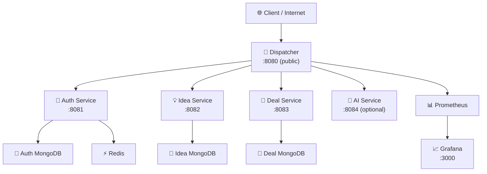
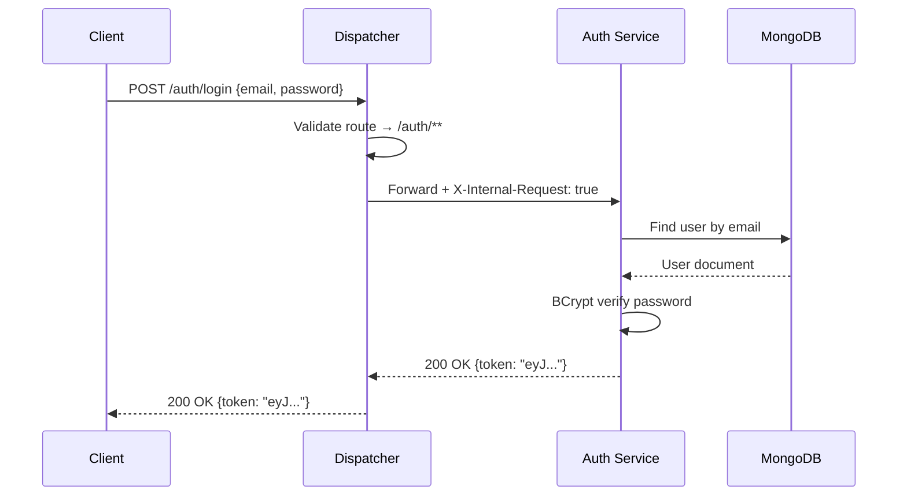
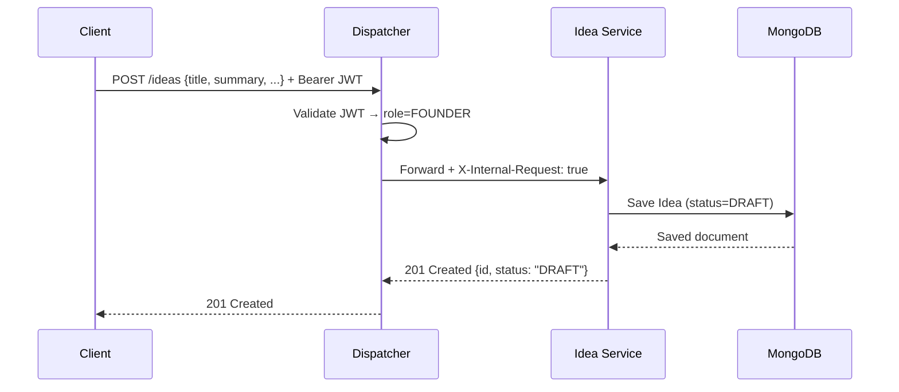
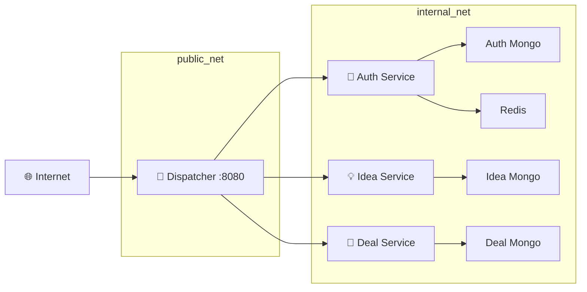

# Java Microservices Investment Platform

> **A cloud-native investment matchmaking platform** connecting founders, investors, and admins through a secure, observable microservices architecture.

---

## Table of Contents

1. [Problem Statement](#1-problem-statement)
2. [Architecture Overview](#2-architecture-overview)
3. [Microservices & Database Isolation](#3-microservices--database-isolation)
4. [Dispatcher — TDD Proof](#4-dispatcher--tdd-proof)
5. [REST Maturity Model (RMM Level 2)](#5-rest-maturity-model-rmm-level-2)
6. [Running the Project](#6-running-the-project)
7. [Monitoring & Observability](#7-monitoring--observability)
8. [Load Testing Results](#8-load-testing-results)
9. [Team & Contributions](#10-team--contributions)

---

## 1. Problem Statement

<!-- TODO: Fill in before submission -->
> Describe the real-world problem. Who are the users (founders, investors, admins)? What pain point does this platform solve? Keep it to 3–5 sentences.

**Target Users:**
- **Founders** — submit and manage startup ideas
- **Investors** — browse verified ideas and make offers
- **Admins** — verify ideas, manage users, view platform health

---

## 2. Architecture Overview

<!-- TODO: Replace with final Mermaid diagram -->

The platform uses a **dispatcher-first microservices pattern**. All client traffic enters through a single public gateway (the Dispatcher on port `8080`), which handles JWT validation, role-based authorization, and request proxying to internal services. No internal service is directly reachable from outside the Docker network.



### Sequence Diagram — Login Flow



### Sequence Diagram — Create Idea Flow



---

## 3. Microservices & Database Isolation

Each service owns its own MongoDB instance. No service queries another service's database — all cross-service data needs go through the Dispatcher.

| Service | Port (internal) | Database | Responsibility |
|---|---|---|---|
| Dispatcher | 8080 | dispatcher-mongo | Routing, JWT validation, metrics |
| Auth Service | 8081 | auth-mongo | Register, login, logout, token management |
| Idea Service | 8082 | idea-mongo | Idea CRUD, status transitions, filtering |
| Deal Service | 8083 | deal-mongo | Offers, matches, abuse reports |
| AI Service | 8084 | — (MongoDB cache) | Idea feedback, investor matching (optional) |

### Network Isolation



> **Key rule:** All internal services reject any request missing the `X-Internal-Request: true` header — ensuring only the Dispatcher can call them.

---

## 4. Dispatcher — TDD Proof

The Dispatcher was built strictly following **Red → Green → Refactor** TDD cycles. Failing tests were committed before any implementation.

### Commit Timeline

<!-- TODO: Replace with actual git log output before submission -->
<!-- Run: git log --oneline --author="<your-name>" | grep -E "test:|feat:|refactor:" -->

```
abc1234  test: add routing test skeletons (RED)         ← failing tests committed first
def5678  test: add authz and error handling tests (RED)
ghi9012  feat: dispatcher routing + authz GREEN
jkl3456  refactor: extract interfaces, add retry policy
```

### Test Results

<!-- TODO: Paste output of `mvn test` from dispatcher module -->

```
[INFO] Tests run: XX, Failures: 0, Errors: 0, Skipped: 0
```

| Test Class | Tests | Status |
|---|---|---|
| `DispatcherRoutingTest` | `whenAuthPath_thenRoutesToAuthService` | ✅ |
| `DispatcherRoutingTest` | `whenIdeasPath_thenRoutesToIdeaService` | ✅ |
| `DispatcherAuthzTest` | `whenNoJwt_thenReturns401` | ✅ |
| `DispatcherAuthzTest` | `whenWrongRole_thenReturns403` | ✅ |
| `DispatcherErrorTest` | `whenServiceDown_thenReturns503` | ✅ |
| `DispatcherErrorTest` | `whenBadUrl_thenReturns404` | ✅ |

---

## 5. REST Maturity Model (RMM Level 2)

All endpoints use **nouns** (not verbs), proper **HTTP methods**, and meaningful **status codes** — satisfying RMM Level 2.

### Auth Service

| Endpoint | Method | Success | Error | Description |
|---|---|---|---|---|
| `/auth/register` | `POST` | `201 Created` | `409 Conflict` | Register new user |
| `/auth/login` | `POST` | `200 OK` | `401 Unauthorized` | Login + receive JWT |
| `/auth/logout` | `POST` | `200 OK` | `401` | Blacklist token in Redis |
| `/auth/me` | `GET` | `200 OK` | `401` | Get own profile from JWT |

### Idea Service

| Endpoint | Method | Success | Error | Description |
|---|---|---|---|---|
| `/ideas` | `POST` | `201 Created` | `403 Forbidden` | Create idea (FOUNDER) |
| `/ideas` | `GET` | `200 OK` | `401` | List ideas (role-filtered) |
| `/ideas/{id}` | `GET` | `200 OK` | `404 Not Found` | Get idea by ID |
| `/ideas/{id}` | `PUT` | `200 OK` | `403`, `404` | Update own DRAFT (FOUNDER) |
| `/ideas/{id}` | `DELETE` | `204 No Content` | `403`, `404` | Delete own DRAFT (FOUNDER) |
| `/ideas/{id}/verify` | `PATCH` | `200 OK` | `403` | Verify idea (ADMIN) |

### Deal Service

| Endpoint | Method | Success | Error | Description |
|---|---|---|---|---|
| `/deals/profiles` | `POST` | `201 Created` | `403` | Create investor profile |
| `/deals/offers` | `POST` | `201 Created` | `403` | Make offer (INVESTOR) |
| `/deals/offers/{id}` | `GET` | `200 OK` | `404` | Get offer details |
| `/deals/offers/{id}/accept` | `PATCH` | `200 OK` | `403`, `404` | Accept offer (FOUNDER) |
| `/deals/matches` | `GET` | `200 OK` | `401` | List matches for user |
| `/deals/reports` | `POST` | `201 Created` | `401` | Report abuse |

---

## 6. Running the Project

### Prerequisites

- Docker Desktop (v24+)
- Java 21
- Maven 3.9+

### Start the Platform (3 commands)

```bash
# 1. Clone the repository
git clone https://github.com/<your-org>/investors-platform.git
cd investors-platform

# 2. Build all services
mvn clean package -DskipTests

# 3. Start everything
docker-compose up --build
```

### Verify Services Are Running

```bash
# Check all containers are healthy
docker-compose ps

# Test the dispatcher is reachable
curl http://localhost:8080/actuator/health

# View Grafana dashboard
open http://localhost:3000   # admin / admin
```

### Environment Variables

Copy `.env.example` to `.env` and fill in your values:

```bash
cp .env.example .env
```

| Variable | Description | Example |
|---|---|---|
| `JWT_SECRET` | HS256 signing secret (min 32 chars) | `your-secret-here` |
| `OPENAI_API_KEY` | For AI service (optional) | `sk-...` |

---

## 7. Monitoring & Observability

### Grafana Dashboards

> **TODO:** Replace placeholders with real screenshots taken during load tests.

| Dashboard | Screenshot |
|---|---|
| Requests Per Second (per route) | *(screenshot here)* |
| Latency p50 / p95 / p99 | *(screenshot here)* |
| Error Rate (4xx vs 5xx) | *(screenshot here)* |
| Service Health (up/down) | *(screenshot here)* |

**Access Grafana:** `http://localhost:3000` (default: `admin` / `admin`)

### Structured Logging

All services emit JSON logs with a `correlation_id` (trace ID) injected by the Dispatcher. This allows tracing a single request across all service logs.

```json
{
  "timestamp": "2025-01-01T12:00:00.000Z",
  "level": "INFO",
  "service": "idea-service",
  "correlation_id": "f47ac10b-58cc-4372-a567-0e02b2c3d479",
  "message": "Idea created",
  "idea_id": "abc123",
  "founder_id": "user456"
}
```

---

## 8. Load Testing Results

Load tests run with **k6** against the Dispatcher (`http://localhost:8080`).

### Test Scenarios

| Scenario | Users | Duration | Description |
|---|---|---|---|
| Spike | 0 → 200 | 30s ramp + 1min hold | Sudden traffic burst |
| Sustained S | 50 | 5 min | Baseline steady load |
| Sustained M | 100 | 5 min | Moderate load |
| Sustained L | 200 | 5 min | High load |
| Sustained XL | 500 | 5 min | Stress test |

### Results

<!-- TODO: Fill in after running load tests (Phase 8) -->

| Scenario | Avg Latency | p95 Latency | p99 Latency | Error Rate | Throughput (RPS) |
|---|---|---|---|---|---|
| Spike (200 users) | — ms | — ms | — ms | —% | — |
| Sustained 50 | — ms | — ms | — ms | —% | — |
| Sustained 100 | — ms | — ms | — ms | —% | — |
| Sustained 200 | — ms | — ms | — ms | —% | — |
| Sustained 500 | — ms | — ms | — ms | —% | — |

### Run Load Tests Yourself

```bash
# Install k6
brew install k6   # macOS

# Run sustained test (100 users)
k6 run k6/sustained-test.js

# Run spike test
k6 run k6/spike-test.js
```

---


## 9. Team & Contributions

| Member | GitHub | Key Responsibilities |
|---|---|---|
| <!-- Hamza Al Halabi --> | @<!-- handle --> | <!-- e.g. Dispatcher, TDD, Docker,Idea Service, Observability --> |
| <!-- Emad Al Abdul Rahman --> | @<!-- handle --> | <!-- e.g. Auth Service, Security, Deal Service, Load Testing --> |

> **Commit parity:** All team members have equal commit counts. Verify with:
> ```bash
> git shortlog -sn --all
> ```

---

*Built for the Java Microservices course — academic project.*